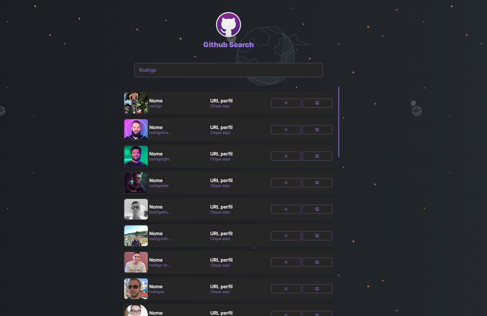
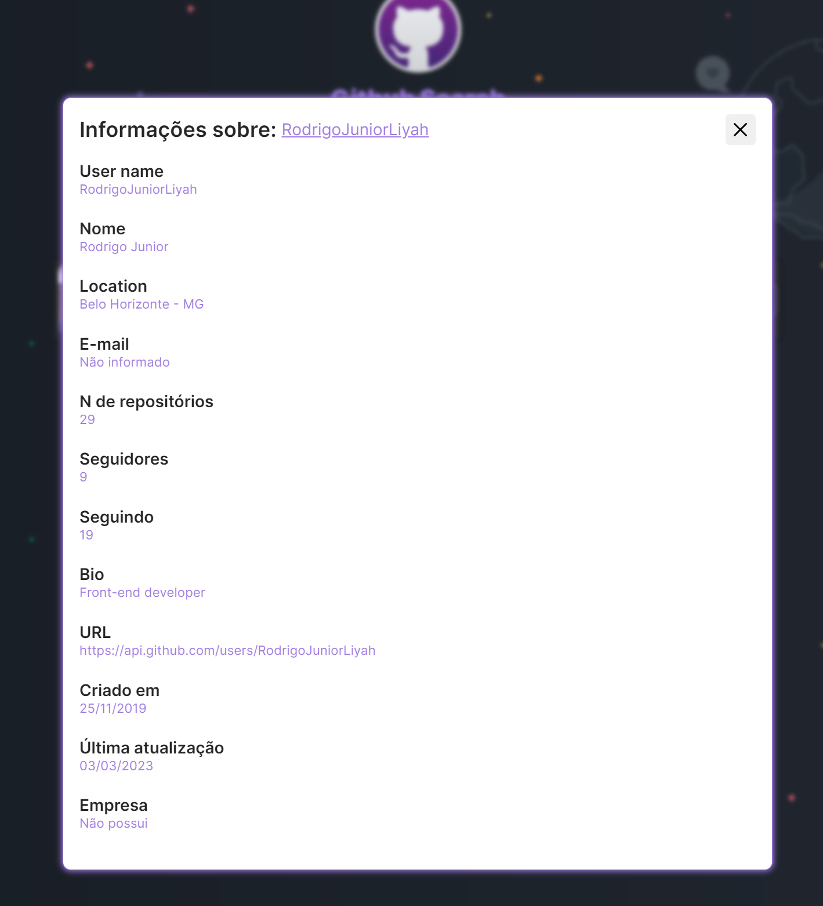
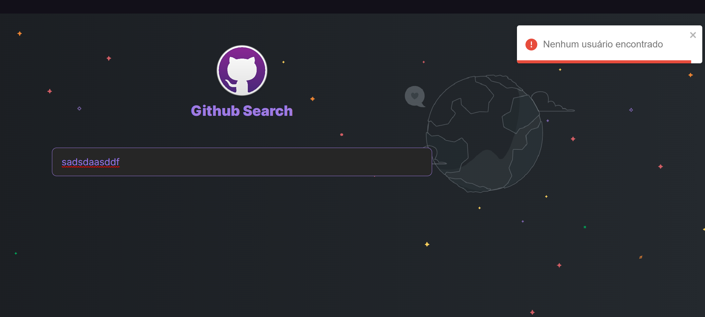

  

  

  
   

  

<h1 align="center">
  Github Search
</h1>

<h4 align="center"> 
	🚧  Github Search 👨‍💻 Concluído 🚀 🚧
</h4>

 <a href="#-sobre-o-projeto">Sobre</a> •
 <a href="#-funcionalidades">Funcionalidades</a> •
 <a href="#-como-executar-o-projeto">Como executar</a> • 
 <a href="#-tecnologias">Tecnologias</a> • 
 <a href="#-autor">Autor</a> • 
 <a href="#user-content--licença">Licença</a>

## 💻 Sobre o projeto

Este é um componente de uma aplicação React que permite pesquisar usuários do Github e exibir algumas informações sobre eles. Quando o usuário digita um termo de pesquisa na barra de pesquisa, o componente envia uma solicitação à API do Github e exibe os resultados da pesquisa como uma lista de cards. Quando o usuário clica em um card, um modal é aberto exibindo informações mais detalhadas sobre o usuário. Também há feedback de possíveis erros em caso de: Usuário não encontrado, excesso de requisições e falha na requisição.

---

## ⚙️Funcionalidades

- [x] Pesquisar usuários do Github através da API do Github
- [x] Exibir informações básicas dos usuários em cards na tela
- [x] Exibir informações detalhadas de um usuário em um modal
- [x] Feedback de erros em caso de usuário não encontrado, excesso de requisições ou falha na requisição.

---

## 💡Funcionamento

O componente utiliza o hook useState para armazenar os dados do usuário e indicar quando a página está carregando. O hook useEffect é utilizado para atualizar a página quando o usuário faz uma pesquisa ou quando um usuário é selecionado. A biblioteca Axios é utilizada para fazer a requisição à API do Github.

O projeto está organizado em módulos separados para melhor legibilidade e manutenibilidade, utilizando a estrutura de pastas do tipo Componentização.

---

### Images

---

## 🚀 Como executar o projeto

3. Web (pasta do projeto) <a href="https://github.com/RodrigoJuniorLiyah/Angular-request-api-and-save-localstorage/archive/refs/heads/main.zip">baixe aqui</a>

### Pré-requisitos

Antes de começar, você vai precisar ter instalado em sua máquina as seguintes ferramentas:
[Git](https://git-scm.com), [Node.js](https://nodejs.org/en/).
Além disto é bom ter um editor para trabalhar com o código como [VSCode](https://code.visualstudio.com/)

---

## 🛠 Tecnologias

As seguintes ferramentas foram usadas na construção do projeto:

- **[React](https://pt-br.reactjs.org/)**
- **[Chakra UI](https://chakra-ui.com/)**
- **[React Icons](https://react-icons.github.io/react-icons/)**
- **[Toastify](https://fkhadra.github.io/react-toastify/introduction)**
- **[Axios](https://www.npmjs.com/package/axios)**
- **[Cypress](https://www.cypress.io/)**

> Veja o arquivo [package.json](https://github.com/RodrigoJuniorLiyah/Github-search-React-typescript/blob/main/package.json)

## 💪 Como contribuir para o projeto

1. Faça um **fork** do projeto.
2. Crie uma nova branch com as suas alterações: `git checkout -b my-feature`
3. Salve as alterações e crie uma mensagem de commit contando o que você fez: `git commit -m "feature: My new feature"`
4. Envie as suas alterações: `git push origin my-feature`

> Caso tenha alguma dúvida confira este [guia de como contribuir no GitHub](./CONTRIBUTING.md)

---

## 🐱‍👤 Autor

 
 <b>Rodrigo Cabral 🚀</b>
  

 

---

## 📝 Licença

Este projeto esta sobe a licença [MIT](./LICENSE).

Feito com ❤️ por Rodrigo Junior 👋🏽 [Entre em contato!](https://www.linkedin.com/in/rodrigo-cabral-dev/)
